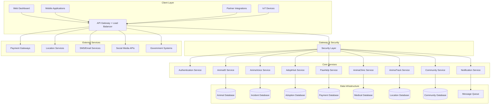

import { Cards, Card } from 'nextra/components'
import { Steps } from 'nextra/components'
import { Tabs, Tab } from 'nextra/components'
import { FileTree } from 'nextra/components'
import { Callout } from 'nextra/components'

# Anima Unity Platform

**Digital ecosystem for animal welfare transformation across Indonesia and Southeast Asia**

> *"Tidak ada hewan yang dibiarkan tertinggal" - No animal left behind*

---

## Executive Summary

Anima Unity represents a comprehensive digital transformation initiative for animal welfare operations across Indonesia and Southeast Asia. Our integrated platform combines advanced technology with community-driven solutions to address critical challenges in animal rescue, healthcare, adoption, and welfare management.

The platform delivers measurable impact through seven core modules: digital identity management (AnimaID), emergency rescue coordination (AnimaVoice), intelligent adoption matching (AdoptHub), transparent donation management (PawHelp), telemedicine services (AnimaClinic), real-time tracking systems (AnimaTrack), and community engagement tools (Community Hub).

<Cards>
  <Card
    icon={
      <svg xmlns="http://www.w3.org/2000/svg" viewBox="0 0 24 24" fill="none" stroke="currentColor" strokeWidth="2" strokeLinecap="round" strokeLinejoin="round" height="32" width="32">
        <path d="M13 2H6a2 2 0 0 0-2 2v16a2 2 0 0 0 2 2h12a2 2 0 0 0 2-2V9z" />
        <polyline points="13 2 13 9 20 9" />
      </svg>
    }
    title="Implementation Guide"
    href="/getting-started"
    arrow
  >
    Complete setup and deployment instructions for rapid platform integration
  </Card>
  <Card
    icon={
      <svg xmlns="http://www.w3.org/2000/svg" viewBox="0 0 24 24" fill="none" stroke="currentColor" strokeWidth="2" strokeLinecap="round" strokeLinejoin="round" height="32" width="32">
        <path d="M14 2H6a2 2 0 0 0-2 2v16a2 2 0 0 0 2 2h12a2 2 0 0 0 2-2V8z" />
        <polyline points="14 2 14 8 20 8" />
        <line x1="16" y1="13" x2="8" y2="13" />
        <line x1="16" y1="17" x2="8" y2="17" />
        <polyline points="10 9 9 9 8 9" />
      </svg>
    }
    title="API Documentation"
    href="/api-docs"
    arrow
  >
    Technical specifications, endpoints, and integration examples
  </Card>
  <Card
    icon={
      <svg xmlns="http://www.w3.org/2000/svg" viewBox="0 0 24 24" fill="none" stroke="currentColor" strokeWidth="2" strokeLinecap="round" strokeLinejoin="round" height="32" width="32">
        <circle cx="12" cy="12" r="10" />
        <line x1="12" y1="16" x2="12" y2="12" />
        <line x1="12" y1="8" x2="12.01" y2="8" />
      </svg>
    }
    title="SDK Reference"
    href="/sdk-docs"
    arrow
  >
    Official SDKs and development tools for seamless integration
  </Card>
</Cards>

---

## Platform Architecture

### Enterprise Infrastructure

<Tabs items={['Production', 'Staging', 'Development']}>
  <Tab>
    **Production Environment**
    ```bash
    API Base URL:     https://api.animaunity.id/v1
    Dashboard:        https://dashboard.animaunity.id
    WebSocket:        wss://realtime.animaunity.id
    Mobile API:       https://mobile-api.animaunity.id/v1
    ```
    
    **Infrastructure Specifications**
    - Multi-region deployment (Jakarta, Singapore, Kuala Lumpur)
    - Auto-scaling container orchestration
    - 99.99% uptime SLA with automatic failover
    - 24/7 monitoring with intelligent alerting
    - Global CDN for optimized content delivery
    - Real-time backup with disaster recovery protocols
    - Advanced security monitoring and threat detection
  </Tab>
  <Tab>
    **Staging Environment**
    ```bash
    API Base URL:     https://staging-api.animaunity.id/v1
    Dashboard:        https://staging-dashboard.animaunity.id
    WebSocket:        wss://staging-realtime.animaunity.id
    Mobile API:       https://staging-mobile-api.animaunity.id/v1
    ```
    
    **Environment Features**
    - Production-mirrored infrastructure with sanitized data
    - API version previews and feature testing
    - Partner integration validation environment
    - Load testing and performance benchmarking
    - User acceptance testing for shelter partners
    - Automated testing pipeline integration
  </Tab>
  <Tab>
    **Development Environment**
    ```bash
    API Base URL:     https://dev-api.animaunity.id/v1
    Dashboard:        https://dev-dashboard.animaunity.id
    WebSocket:        wss://dev-realtime.animaunity.id
    Mobile API:       https://dev-mobile-api.animaunity.id/v1
    ```
    
    **Development Features**
    - Rapid deployment with hot-reload capabilities
    - Comprehensive debug logging and monitoring
    - Mock payment services and sandbox data
    - No rate limits for development testing
    - Automated test data generation and reset tools
    - Integration with development workflow tools
  </Tab>
</Tabs>

### System Design Overview

Our platform employs a sophisticated microservices architecture designed for scalability, reliability, and maintainability in mission-critical animal welfare operations.



---

## Core Platform Modules

### AnimaID - Digital Identity Management System

<Callout type="info">
**AnimaID** provides comprehensive digital identity management for animals through blockchain-verified QR codes, enabling complete lifecycle tracking from rescue to adoption.
</Callout>

**Key Capabilities:**

**Digital Profile Management**
- Comprehensive animal profiles with multimedia documentation
- Unique QR code generation with blockchain verification
- Complete ownership history and transfer documentation
- Real-time status updates and availability tracking
- Government registry integration and compliance

**Medical Information Integration**
- Complete medical history with encrypted storage
- Automated vaccination scheduling and reminders
- Digital prescription management and tracking
- Laboratory results and diagnostic report storage
- Emergency medical information quick access

**Lost Animal Recovery Network**
- Intelligent alert system for missing animals
- GPS-based location sharing and tracking
- Community-driven search coordination
- Reward system management for successful recoveries
- Social media platform integration for broader reach

### AnimaVoice - Emergency Response & Reporting Platform

**Real-time Incident Management**
- Multi-media evidence submission with geo-tagging
- GPS location tracking with address resolution
- AI-powered severity classification and prioritization
- Anonymous reporting capabilities with privacy protection
- Multi-language support for diverse communities

**Volunteer Network Coordination**
- Verified volunteer database with skill profiling
- Intelligent task assignment based on location and expertise
- Real-time dispatch system with status tracking
- Comprehensive training program management
- Performance analytics and recognition systems

**Authority Integration Framework**
- Direct integration with local animal control departments
- Police system connectivity for abuse cases
- Automated case escalation protocols
- Legal documentation and evidence management
- Government reporting compliance and audit trails

### AdoptHub - Intelligent Adoption Matching Platform

**AI-Powered Compatibility Analysis**
- Advanced lifestyle compatibility assessment
- Comprehensive pet personality profiling
- Housing suitability evaluation algorithms
- Experience level matching and recommendations
- Family composition and dynamics analysis

**Verified Shelter Network Management**
- Certified shelter partnership program
- Real-time animal availability synchronization
- Comprehensive shelter rating and review system
- Adoption success rate tracking and analytics
- Post-adoption support program coordination

**Automated Process Management**
- Digital application forms with smart validation
- Integrated background check systems
- Intelligent interview scheduling and coordination
- Automated contract generation and digital signing
- Systematic follow-up and support automation

### PawHelp - Transparent Donation Management Platform

**Campaign-Based Fundraising**
- Individual animal treatment campaign creation
- Real-time photo and video progress documentation
- Dynamic funding goal tracking and visualization
- Detailed medical expense breakdown and verification
- Veterinary cost validation and approval workflows

**Blockchain Transparency**
- Immutable transaction logging and verification
- Public audit trail with real-time access
- Detailed fund allocation tracking and reporting
- Comprehensive impact measurement and analytics
- Multi-tiered donor recognition and engagement systems

**Advanced Payment Processing**
- Multiple payment gateway integration (GoPay, OVO, DANA, Bank Transfer)
- Recurring donation setup and management
- Corporate sponsorship program tools
- International payment processing capabilities
- Automated tax deduction receipt generation

### AnimaClinic - Telemedicine & Healthcare Platform

**Virtual Consultation Services**
- High-definition video consultations with veterinarians
- Screen sharing for medical imaging and lab results
- Digital prescription generation and management
- Automated follow-up appointment scheduling
- Emergency consultation prioritization protocols

**AI-Powered Health Assistant**
- Intelligent symptom analysis and preliminary diagnosis
- Photo-based condition assessment and recommendations
- Medication interaction warnings and safety alerts
- Comprehensive health risk assessment tools
- Preventive care scheduling and recommendations

**Practice Management Integration**
- Comprehensive appointment booking and management
- Electronic health records with secure cloud storage
- Integrated billing and insurance processing
- Inventory management with automated alerts
- Multi-clinic network support and coordination

### AnimaTrack - Real-time Location Intelligence System

**GPS Device Integration**
- Real-time location tracking with sub-meter accuracy
- Customizable geo-fencing with intelligent zone management
- Battery life monitoring with low-power alerts
- Waterproof and ruggedized device options
- Solar charging capabilities for extended operation

**Intelligent Alert System**
- Advanced escape detection algorithms
- Unusual behavior pattern recognition and alerts
- Health monitoring integration with wearable devices
- Weather-based safety warnings and recommendations
- Emergency location sharing with emergency contacts

**Analytics & Insights**
- Comprehensive activity pattern analysis
- Exercise and health correlation reporting
- Territory mapping and behavioral insights
- Social interaction tracking and analysis
- Predictive health and behavior trend reports

### Community Hub - Social Engagement Platform

**Forum & Discussion Management**
- Topic-based community organization
- Expert-moderated Q&A sessions
- Success story sharing and inspiration
- Local community group coordination
- Multi-language support with real-time translation

**Event Coordination**
- Adoption drive organization and management
- Vaccination campaign coordination
- Educational workshop scheduling and promotion
- Volunteer recruitment event management
- Fundraising activity planning and execution

**Gamification & Engagement**
- Points-based reward system for rescue activities
- Achievement badges for milestone recognition
- Community leaderboards and competition
- Comprehensive rewards program integration
- Social sharing incentives and viral marketing tools

---

## Technical Implementation

### Security Architecture

<Steps>

### Multi-Factor Authentication System
- OAuth 2.0 and OpenID Connect integration
- Multi-factor authentication with biometric support
- Mobile device biometric authentication
- JWT token management with secure refresh mechanisms
- Single Sign-On (SSO) integration for shelter partners

### Advanced Authorization Framework
- Role-based access control (RBAC) with granular permissions
- Resource-level access control and data isolation
- API scope management and rate limiting
- Shelter-specific data segregation and privacy
- Volunteer access controls with activity monitoring

### Data Protection & Privacy Compliance
- End-to-end encryption for sensitive animal and personal data
- AES-256 encryption for data at rest
- TLS 1.3 for all data transmission
- GDPR compliance tools and automated data handling
- Indonesia Data Protection Act compliance
- Automated data retention and deletion policies

</Steps>

### API Architecture & Data Models

Our RESTful API follows OpenAPI 3.0 specifications with comprehensive animal welfare data structures:

```kotlin
data class AnimalProfile(
    val id: String,
    val animaId: String, // Blockchain-verified unique identifier
    val basicInfo: BasicAnimalInfo,
    val medicalProfile: MedicalProfile,
    val locationData: LocationData,
    val rescueHistory: RescueHistory,
    val adoptionInfo: AdoptionInfo,
    val ownershipRecord: OwnershipRecord,
    val metadata: ProfileMetadata
)

data class BasicAnimalInfo(
    val name: String,
    val species: AnimalSpecies,
    val breed: String,
    val age: AgeInformation,
    val gender: Gender,
    val size: AnimalSize,
    val color: String,
    val markings: List<String>,
    val microchipId: String?,
    val photos: List<PhotoRecord>
)

enum class AnimalSpecies { 
    DOG, CAT, BIRD, RABBIT, REPTILE, FARM_ANIMAL, WILDLIFE, OTHER 
}

data class AgeInformation(
    val years: Int,
    val months: Int,
    val isEstimate: Boolean,
    val lastUpdated: String
)

enum class Gender { MALE, FEMALE, UNKNOWN }

enum class AnimalSize { SMALL, MEDIUM, LARGE, EXTRA_LARGE }

data class MedicalProfile(
    val vaccinations: List<VaccinationRecord>,
    val medications: List<MedicationRecord>,
    val conditions: List<MedicalCondition>,
    val allergies: List<String>,
    val surgeries: List<SurgeryRecord>,
    val veterinaryContacts: List<VeterinaryContact>,
    val insuranceInfo: InsuranceInformation?
)

data class VaccinationRecord(
    val vaccineType: String,
    val administrationDate: String,
    val nextDueDate: String,
    val veterinarianId: String,
    val batchNumber: String,
    val reactions: List<String>
)

data class LocationData(
    val currentLocation: Coordinates,
    val lastKnownLocation: Coordinates,
    val homeAddress: Address,
    val trackingEnabled: Boolean,
    val locationHistory: List<LocationHistoryEntry>
)

data class RescueHistory(
    val rescueDate: String?,
    val rescuerId: String?,
    val rescueCircumstances: String,
    val initialCondition: HealthCondition,
    val rescueLocation: Coordinates,
    val recoveryProgress: RecoveryStatus
)

enum class RecoveryStatus { 
    CRITICAL, STABLE, RECOVERING, HEALTHY, RELEASED 
}

data class AdoptionInfo(
    val isAdoptable: Boolean,
    val adoptionFee: MonetaryAmount?,
    val specialRequirements: List<String>,
    val idealHomeDescription: String?,
    val pendingApplications: Int,
    val adoptionRestrictions: List<String>
)
```

### Real-time Communication

WebSocket implementation for mission-critical real-time updates:

```kotlin
sealed class AnimaUnityRealtimeEvent {
    abstract val eventId: String
    abstract val timestamp: String
    abstract val priority: EventPriority
}

data class RescueEmergencyAlert(
    override val eventId: String,
    override val timestamp: String,
    override val priority: EventPriority = EventPriority.CRITICAL,
    val animalId: String,
    val location: Coordinates,
    val urgencyLevel: UrgencyLevel,
    val description: String,
    val reporterId: String,
    val estimatedResponseTime: Int,
    val requiredResources: List<String>
) : AnimaUnityRealtimeEvent()

data class AdoptionStatusUpdate(
    override val eventId: String,
    override val timestamp: String,
    override val priority: EventPriority = EventPriority.MEDIUM,
    val animalId: String,
    val newStatus: AdoptionStatus,
    val adopterId: String?,
    val nextSteps: List<String>
) : AnimaUnityRealtimeEvent()

enum class EventPriority { LOW, MEDIUM, HIGH, CRITICAL }
enum class UrgencyLevel { LOW, MODERATE, HIGH, CRITICAL, LIFE_THREATENING }
```

---

## Platform Organization

<FileTree>
  <FileTree.Folder name="Anima Unity Ecosystem" defaultOpen>
    <FileTree.Folder name="Core Platform Modules" defaultOpen>
      <FileTree.Folder name="AnimaID - Digital Identity" defaultOpen>
        <FileTree.File name="Blockchain Identity Management" />
        <FileTree.File name="QR Code Generation & Verification" />
        <FileTree.File name="Animal Profile Management" />
        <FileTree.File name="Medical Records Integration" />
        <FileTree.File name="Government Registry Sync" />
      </FileTree.Folder>
      <FileTree.Folder name="AnimaVoice - Emergency Response" defaultOpen>
        <FileTree.File name="Real-time Incident Reporting" />
        <FileTree.File name="Volunteer Dispatch System" />
        <FileTree.File name="Authority Integration Hub" />
        <FileTree.File name="Emergency Coordination" />
        <FileTree.File name="Case Management System" />
      </FileTree.Folder>
      <FileTree.Folder name="AdoptHub - Adoption Platform">
        <FileTree.File name="AI Matching Algorithm" />
        <FileTree.File name="Shelter Network Management" />
        <FileTree.File name="Application Processing System" />
        <FileTree.File name="Post-Adoption Support" />
        <FileTree.File name="Success Rate Analytics" />
      </FileTree.Folder>
      <FileTree.Folder name="PawHelp - Donation Management">
        <FileTree.File name="Campaign Management System" />
        <FileTree.File name="Blockchain Payment Processing" />
        <FileTree.File name="Transparency Reporting" />
        <FileTree.File name="Impact Measurement Analytics" />
        <FileTree.File name="Donor Relationship Management" />
      </FileTree.Folder>
      <FileTree.Folder name="AnimaClinic - Telemedicine">
        <FileTree.File name="Virtual Consultation Platform" />
        <FileTree.File name="AI Health Assessment Tools" />
        <FileTree.File name="Appointment Management" />
        <FileTree.File name="Digital Prescription System" />
        <FileTree.File name="Practice Integration Suite" />
      </FileTree.Folder>
      <FileTree.Folder name="AnimaTrack - Location Intelligence">
        <FileTree.File name="GPS Tracking Infrastructure" />
        <FileTree.File name="IoT Device Management" />
        <FileTree.File name="Location Analytics Engine" />
        <FileTree.File name="Emergency Alert System" />
        <FileTree.File name="Behavioral Analysis Tools" />
      </FileTree.Folder>
      <FileTree.Folder name="Community Hub - Social Platform">
        <FileTree.File name="Forum & Discussion System" />
        <FileTree.File name="Event Management Tools" />
        <FileTree.File name="Gamification Engine" />
        <FileTree.File name="Social Features Suite" />
        <FileTree.File name="Community Analytics" />
      </FileTree.Folder>
    </FileTree.Folder>
    <FileTree.Folder name="Infrastructure & Services">
      <FileTree.File name="API Gateway & Load Balancer" />
      <FileTree.File name="Authentication & Authorization" />
      <FileTree.File name="Real-time Notification System" />
      <FileTree.File name="Advanced Analytics Platform" />
      <FileTree.File name="Administrative Dashboard" />
      <FileTree.File name="Monitoring & Alerting System" />
    </FileTree.Folder>
    <FileTree.Folder name="External Integrations">
      <FileTree.File name="Payment Gateway Connectors" />
      <FileTree.File name="Maps & Location Services" />
      <FileTree.File name="Communication Services (SMS/Email)" />
      <FileTree.File name="Social Media API Integration" />
      <FileTree.File name="Government System Connectors" />
      <FileTree.File name="Third-party Service APIs" />
    </FileTree.Folder>
  </FileTree.Folder>
</FileTree>

---

## Implementation Roadmap

<Steps>

### Partner Registration & Onboarding
Register as a developer partner at [developer.animaunity.id](https://developer.animaunity.id) and select your organization category:

- **Shelter Partner**: Animal shelters and rescue organizations
- **Veterinary Partner**: Veterinary clinics and healthcare providers  
- **Technology Partner**: Software developers and system integrators
- **Community Partner**: Animal welfare activists and volunteer organizations
- **Government Partner**: Municipal and regulatory agencies

### API Credentials & Environment Setup
Generate secure API credentials for your chosen environment:

```bash
curl -X POST https://api.animaunity.id/v1/developers/credentials \
  -H "Authorization: Bearer YOUR_AUTH_TOKEN" \
  -H "Content-Type: application/json" \
  -d '{
    "applicationName": "Animal Welfare Management System",
    "organizationType": "SHELTER_PARTNER",
    "permissions": [
      "read:animals", 
      "write:rescue_reports", 
      "read:donations",
      "write:medical_records"
    ],
    "environment": "production",
    "webhookUrl": "https://your-domain.com/anima-unity-webhooks"
  }'
```

### SDK Installation & Configuration
Install the official Anima Unity SDK for your development environment:

```bash
# Node.js/JavaScript
npm install @animaunity/sdk

# Python
pip install animaunity-python-sdk

# Java/Kotlin
implementation 'com.animaunity:animaunity-sdk:2.1.0'

# PHP
composer require animaunity/php-sdk

# Go
go get github.com/animaunity/go-sdk
```

### Client Initialization & Authentication
Initialize the SDK client with your credentials and preferred configuration:

```kotlin
import com.animaunity.sdk.AnimaUnitySDK

val animaUnityClient = AnimaUnitySDK.builder()
    .apiKey(System.getenv("ANIMA_UNITY_API_KEY"))
    .environment(Environment.PRODUCTION)
    .region(Region.INDONESIA)
    .timeout(Duration.ofSeconds(30))
    .retryPolicy(RetryPolicy.defaultPolicy())
    .enableRealTimeUpdates(true)
    .enableMetrics(true)
    .build()

// Initialize service clients
val rescueService = animaUnityClient.rescue()
val adoptionService = animaUnityClient.adoption()
val medicalService = animaUnityClient.medical()
val donationService = animaUnityClient.donation()
```

### First Integration - Emergency Rescue Report
Implement your first integration with the emergency rescue reporting system:

```kotlin
// Report an animal emergency with comprehensive details
val emergencyReport = rescueService.createEmergencyReport(
    EmergencyReportRequest.builder()
        .location(
            Coordinates.builder()
                .latitude(-6.2088)
                .longitude(106.8456)
                .address("Jl. Sudirman No. 123, Jakarta Pusat")
                .build()
        )
        .animalDetails(
            EmergencyAnimalDetails.builder()
                .species(AnimalSpecies.DOG)
                .estimatedAge(
                    AgeInformation.builder()
                        .years(2)
                        .months(6)
                        .isEstimate(true)
                        .build()
                )
                .condition(HealthCondition.INJURED)
                .urgencyLevel(UrgencyLevel.HIGH)
                .description("Injured dog found on roadside, appears to have been hit by vehicle. Conscious but limping severely.")
                .build()
        )
        .evidence(
            EvidenceSubmission.builder()
                .photos(listOf("base64_encoded_image_1", "base64_encoded_image_2"))
                .videos(listOf("base64_encoded_video_1"))
                .audioNotes("voice_memo_base64")
                .build()
        )
        .reporterInformation(
            ReporterInfo.builder()
                .name("Dr. Sarah Johnson")
                .contactNumber("+6281234567890")
                .email("sarah.johnson@veterinary-clinic.com")
                .organizationId("vet_clinic_001")
                .isAnonymous(false)
                .build()
        )
        .requestedResponse(
            ResponseRequest.builder()
                .volunteersNeeded(2)
                .veterinarySupport(true)
                .transportationRequired(true)
                .estimatedCost(BigDecimal("500000"))
                .build()
        )
        .build()
)

println("Emergency report created successfully:")
println("Report ID: ${emergencyReport.reportId}")
println("Estimated response time: ${emergencyReport.estimatedResponseTime} minutes")
println("Assigned volunteers: ${emergencyReport.assignedVolunteers.size}")
```

</Steps>

---

## Impact & Analytics Dashboard

Real-time metrics demonstrating the platform's measurable impact on animal welfare across Southeast Asia:

```mermaid
graph TB
    subgraph "Animal Welfare Impact"
        A[Animals Rescued: 28,347] --> B[Successful Adoptions: 15,932]
        B --> C[Medical Treatments: 45,156]
        C --> D[Lost Pets Reunited: 8,578]
        D --> E[Lives Saved: 35,000+]
    end
    
    subgraph "Community Engagement"
        F[Active Volunteers: 25,400] --> G[Partner Shelters: 234]
        G --> H[Veterinary Partners: 156]
        H --> I[Total Donations: Rp 4.8B]
        I --> J[Success Rate: 94.2%]
    end
    
    subgraph "Technology Performance"
        K[Monthly API Calls: 2.4M] --> L[Real-time Alerts: 125K]
        L --> M[Mobile Downloads: 456K]
        M --> N[Platform Uptime: 99.97%]
        N --> O[Response Time: <200ms]
    end
    
    subgraph "Geographic Coverage"
        P[Cities Covered: 45] --> Q[Provinces: 15]
        Q --> R[Countries: 3]
        R --> S[Languages: 8]
    end
```



---

## Partner Program & Resources

<Callout type="info">
**Anima Unity Partner Program** provides comprehensive support, resources, and benefits to organizations committed to advancing animal welfare through technology innovation.
</Callout>

### Partnership Tiers & Benefits

**Shelter Partnership Program**
- Comprehensive API access with priority support
- Reduced transaction fees for donation processing
- Dedicated technical support and integration assistance
- Custom workflow development and optimization
- Marketing and promotional support for adoption campaigns
- Access to trained volunteer network and coordination tools
- Grant application support and funding opportunities

**Veterinary Partnership Network**
- Full telemedicine platform access and integration
- Patient referral system with intelligent matching
- Digital prescription and medication management tools
- Practice management system integration support
- Continuing education resources and certification programs
- Revenue sharing from platform consultations and services
- Professional development and training opportunities

**Technology Partnership Ecosystem**
- Open API access with comprehensive documentation
- SDK and development tool suite access
- Technical documentation and implementation support
- Developer community access and collaboration opportunities
- Co-marketing and business development support
- Revenue sharing opportunities for value-added services
- Priority access to new features and beta programs

### Additional Resources

<Cards>
  <Card 
    title="System Status & Monitoring" 
    href="https://status.animaunity.id" 
    arrow
  >
    Real-time platform health monitoring, incident tracking, and performance metrics
  </Card>
  <Card 
    title="Developer Blog & Updates" 
    href="https://blog.animaunity.id" 
    arrow
  >
    Latest platform updates, technical insights, case studies, and best practices
  </Card>
  <Card 
    title="Community Forum" 
    href="https://community.animaunity.id" 
    arrow
  >
    Connect with shelter partners, volunteers, developers, and animal welfare experts
  </Card>
  <Card 
    title="API Changelog" 
    href="/docs/changelog" 
    arrow
  >
    Complete version history, breaking changes, and platform evolution timeline
  </Card>
  <Card 
    title="Implementation Best Practices" 
    href="/docs/best-practices" 
    arrow
  >
    Proven strategies and guidelines for optimal animal welfare operations
  </Card>
  <Card 
    title="Success Stories & Case Studies" 
    href="/docs/success-stories" 
    arrow
  >
    Real-world implementations and measurable impact achieved by platform partners
  </Card>
</Cards>

---

## Support & Contact Information

**Technical Support:** [support@animaunity.id](mailto:support@animaunity.id)  
**Partnership Inquiries:** [partners@animaunity.id](mailto:partners@animaunity.id)  
**Documentation Feedback:** [docs@animaunity.id](mailto:docs@animaunity.id)  
**Emergency Platform Issues:** [emergency@animaunity.id](mailto:emergency@animaunity.id)

**Business Hours:** Monday - Friday, 08:00 - 17:00 WIB  
**Emergency Support:** 24/7 for critical animal welfare incidents

---

*This documentation is continuously updated to reflect platform enhancements and new capabilities. For the most current information and updates, please refer to our developer portal and status page.*