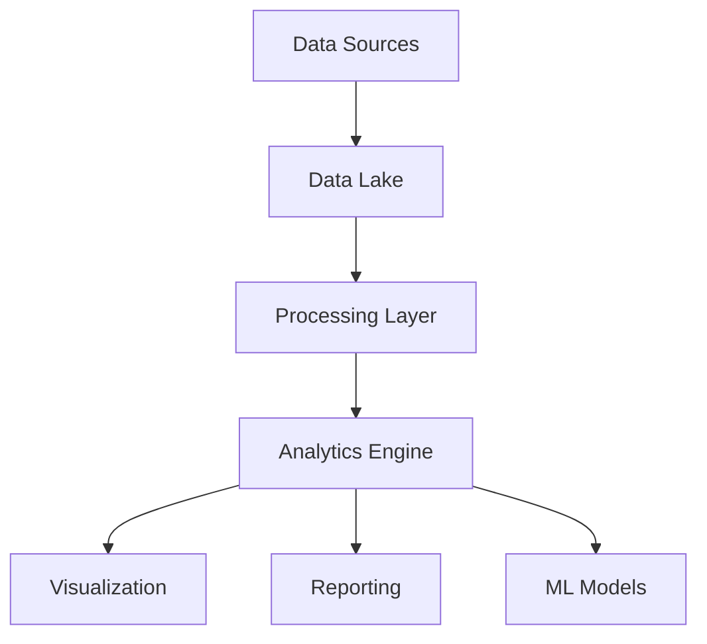
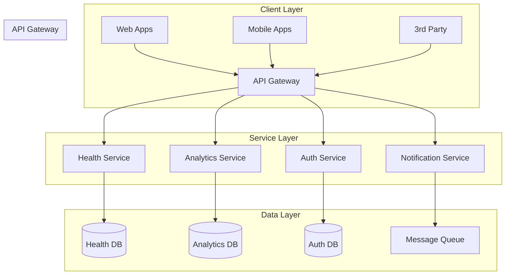

import { Cards, Card } from 'nextra/components'
import { Steps } from 'nextra/components'
import { Tabs, Tab } from 'nextra/components'
import { FileTree } from 'nextra/components'
import { Callout } from 'nextra/components'

# Anima Unity Platform Documentation


## Platform Overview

Anima Unity is an enterprise-grade platform that revolutionizes the pet healthcare ecosystem by seamlessly integrating veterinary services, pet management, and shelter operations. Our platform serves as the backbone for modern pet care facilities, enabling digital transformation across the industry.

<Cards>
  <Card
    icon={
      <svg
        xmlns="http://www.w3.org/2000/svg"
        viewBox="0 0 24 24"
        fill="none"
        stroke="currentColor"
        strokeWidth="2"
        strokeLinecap="round"
        strokeLinejoin="round"
        hight="32"
        width="32"
      >
        <path d="M13 2H6a2 2 0 0 0-2 2v16a2 2 0 0 0 2 2h12a2 2 0 0 0 2-2V9z" />
        <polyline points="13 2 13 9 20 9" />
      </svg>
    }
    title="Quick Start Guide"
    href="/getting-started"
    arrow
  >
    Get up and running with Anima Unity in minutes
  </Card>
  <Card
    icon={
      <svg
        xmlns="http://www.w3.org/2000/svg"
        viewBox="0 0 24 24"
        fill="none"
        stroke="currentColor"
        strokeWidth="2"
        strokeLinecap="round"
        strokeLinejoin="round"
        hight="32"
        width="32"
      >
        <path d="M14 2H6a2 2 0 0 0-2 2v16a2 2 0 0 0 2 2h12a2 2 0 0 0 2-2V8z" />
        <polyline points="14 2 14 8 20 8" />
        <line x1="16" y1="13" x2="8" y2="13" />
        <line x1="16" y1="17" x2="8" y2="17" />
        <polyline points="10 9 9 9 8 9" />
      </svg>
    }
    title="API Reference"
    href="/api-docs"
    arrow
  >
    Complete API documentation with examples
  </Card>
  <Card
    icon={
      <svg
        xmlns="http://www.w3.org/2000/svg"
        viewBox="0 0 24 24"
        fill="none"
        stroke="currentColor"
        strokeWidth="2"
        strokeLinecap="round"
        strokeLinejoin="round"
        hight="32"
        width="32"
      >
        <circle cx="12" cy="12" r="10" />
        <line x1="12" y1="16" x2="12" y2="12" />
        <line x1="12" y1="8" x2="12.01" y2="8" />
      </svg>
    }
    title="SDK Documentation"
    href="/sdk-docs"
    arrow
  >
    Official SDKs and integration guides
  </Card>
</Cards>

## Development Environments

<Tabs items={['Production', 'Staging', 'Development']}>
  <Tab>
    ```bash
    Base URL: https://api.animaunity.com/v2
    Dashboard: https://dashboard.animaunity.com
    WebSocket: wss://realtime.animaunity.com
    ```
    
    ### Production Environment Features
    - Global CDN distribution
    - Automated failover
    - 99.99% uptime SLA
    - 24/7 monitoring
  </Tab>
  <Tab>
    ```bash
    Base URL: https://staging-api.animaunity.com/v2
    Dashboard: https://staging.dashboard.animaunity.com
    WebSocket: wss://staging-realtime.animaunity.com
    ```
    
    ### Staging Environment Features
    - Production mirror
    - Sandbox data
    - API version preview
    - Performance testing
  </Tab>
  <Tab>
    ```bash
    Base URL: https://dev-api.animaunity.com/v2
    Dashboard: https://dev.dashboard.animaunity.com
    WebSocket: wss://dev-realtime.animaunity.com
    ```
    
    ### Development Environment Features
    - Rapid deployment
    - Debug logging
    - Mock services
    - No rate limits
  </Tab>
</Tabs>

## Core Platform Services

### Healthcare Integration Hub

<Callout type="info">
The Healthcare Integration Hub serves as the central nervous system of Anima Unity, connecting various healthcare services and providers.
</Callout>

- **Electronic Health Records (EHR)**  
  - Centralized pet health records  
  - Digital prescription management  
  - Lab results integration  
  - Vaccination tracking  
  - Medical history analysis  
  - Health alerts & reminders  

- **Telemedicine Services**  
  - Video consultation platform  
  - Secure messaging system  
  - Digital diagnosis tools  
  - Remote monitoring  
  - Virtual second opinions  
  - Health risk assessment  

- **Practice Management**  
  - Appointment scheduling  
  - Billing and invoicing  
  - Inventory management  
  - Staff scheduling  
  - Reporting & analytics  
  - Client communication portal  

- **Pet Behavior Analysis**  
  - AI-driven behavior monitoring  
  - Activity pattern tracking  
  - Personalized training plans  
  - Stress detection  

- **Pet Nutrition & Diet**  
  - Customized meal planning  
  - Nutritional value calculator  
  - Weight management program  
  - Integration with pet food delivery  

- **Community Features**  
  - Pet owner forums  
  - Event organization platform  
  - Success stories & reviews  
  - Localized pet meetups  

- **Shelter Management Tools**  
  - Adoption records  
  - Volunteer scheduling  
  - Donation tracking system  
  - Animal intake & status reports  

- **AniShop (Marketplace)**  
  - Pet product catalog  
  - Vendor management system  
  - Secure checkout process  
  - Order tracking  

- **AniCare (Pet Services)**  
  - Grooming scheduling  
  - Pet daycare booking  
  - Service provider ratings  

- **AniFun (Entertainment & Games)**  
  - Interactive pet games  
  - Virtual training challenges  
  - Rewards system for pet bonding  

- **AniTrack (GPS & Monitoring)**  
  - Real-time pet tracking  
  - Geo-fencing alerts  
  - Lost pet notification  

- **AniShelter (Adoption & Support)**  
  - Adoption program portal  
  - Shelter partnership tools  
  - Campaign management for stray animals  

- **Pet ID & Management**  
  - Digital pet ID  
  - QR code-based profiles  
  - Ownership transfer management

### Data Analytics Platform

Our analytics platform provides comprehensive insights into pet healthcare trends and operational metrics:



#### Key Analytics Features
- Real-time metrics dashboard
- Predictive health analytics
- Population health management
- Custom report generation
- Machine learning insights
- Trend analysis tools

### Enterprise Management Console

The Enterprise Management Console provides centralized control over your entire Anima Unity implementation:

<FileTree>
  <FileTree.Folder name="Management Console" defaultOpen>
    <FileTree.Folder name="Administration" defaultOpen>
      <FileTree.File name="User Management" />
      <FileTree.File name="Role Configuration" />
      <FileTree.File name="Access Control" />
    </FileTree.Folder>
    <FileTree.Folder name="Monitoring" defaultOpen>
      <FileTree.File name="System Health" />
      <FileTree.File name="Performance Metrics" />
      <FileTree.File name="Audit Logs" />
    </FileTree.Folder>
    <FileTree.Folder name="Configuration">
      <FileTree.File name="API Settings" />
      <FileTree.File name="Integration Config" />
      <FileTree.File name="Notification Rules" />
    </FileTree.Folder>
  </FileTree.Folder>
</FileTree>

## System Architecture

### Microservices Architecture

Our platform is built on a modern microservices architecture ensuring scalability and reliability:



### Security Infrastructure

<Steps>
### Authentication Layer
- OAuth 2.0 / OpenID Connect
- Multi-factor authentication
- JWT token management
- SSO integration

### Authorization
- Role-based access control (RBAC)
- Resource-level permissions
- API scope management
- Custom security policies

### Data Protection
- End-to-end encryption
- Data masking
- Audit logging
- GDPR compliance tools
</Steps>

## Integration Methods

### REST API

Our REST API follows OpenAPI 3.0 specifications:

```typescript
interface PetHealthRecord {
  id: string;
  petId: string;
  ownerId: string;
  healthData: {
    weight: number;
    temperature: number;
    bloodPressure: {
      systolic: number;
      diastolic: number;
    };
    medications: Array<{
      name: string;
      dosage: string;
      frequency: string;
    }>;
  };
  vetNotes: string;
  timestamp: string;
}
```

### WebSocket API

Real-time updates via WebSocket connections:

```typescript
interface WebSocketMessage {
  type: 'UPDATE' | 'ALERT' | 'STATUS';
  payload: {
    entity: string;
    action: string;
    data: any;
    timestamp: string;
  };
  metadata: {
    version: string;
    source: string;
  };
}
```

### Event-Driven Architecture

<Callout type="warning">
Ensure proper error handling and retry mechanisms when implementing event listeners.
</Callout>

```typescript
interface HealthEvent {
  eventType: 'CHECKUP' | 'VACCINATION' | 'PRESCRIPTION' | 'EMERGENCY';
  petId: string;
  timestamp: string;
  data: {
    type: string;
    description: string;
    severity: 'LOW' | 'MEDIUM' | 'HIGH';
    actionRequired: boolean;
  };
  metadata: {
    clinicId: string;
    vetId: string;
    version: string;
  };
}
```

## Getting Started

<Steps>
### Register Developer Account
Create an account at [developer.animaunity.com](https://developer.animaunity.com)

### Generate API Keys
```bash
curl -X POST https://api.animaunity.com/v2/developers/keys \
  -H "Authorization: Bearer YOUR_TOKEN" \
  -H "Content-Type: application/json"
```

### Install SDK
```bash
# npm
npm install @animaunity/sdk

# yarn
yarn add @animaunity/sdk

# pnpm
pnpm add @animaunity/sdk
```

### Initialize Client
```typescript
import { AnimaUnityClient } from '@animaunity/sdk';

const client = new AnimaUnityClient({
  apiKey: 'your_api_key',
  environment: 'production',
  timeout: 30000,
});
```
</Steps>

## Additional Resources

<Cards>
  <Card title="System Status" href="https://status.animaunity.com" arrow/>
  <Card title="Developer Blog" href="https://blog.animaunity.com" arrow/>
  <Card title="Community Forums" href="https://community.animaunity.com" arrow/>
  <Card title="API Changelog" href="/docs/changelog" arrow/>
  <Card title="Best Practices" href="/docs/best-practices" arrow/>
  <Card title="FAQs" href="/docs/faq" arrow/>
</Cards>