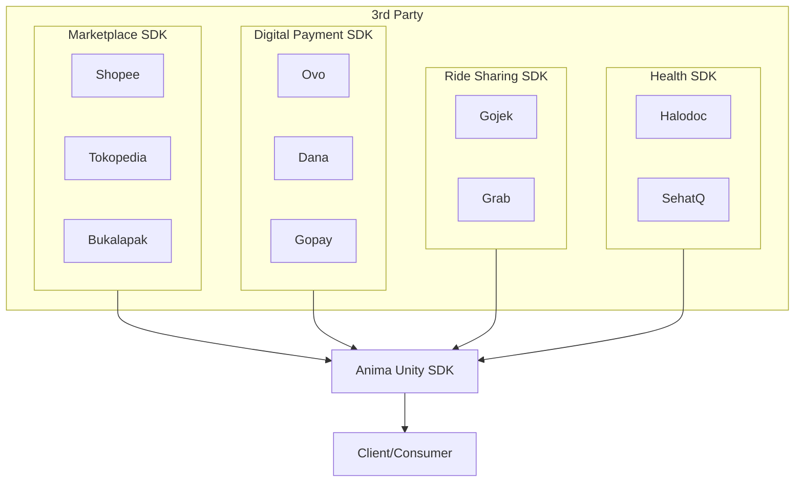

```mermaid
graph TB;
subgraph AAA [3rd Party]

subgraph AA [Marketplace SDK]
A1[Shopee]
B1[Tokopedia]
C1[Bukalapak]
end

subgraph BB [Digital Payment SDK]
A2[Ovo]
B2[Dana]
C2[Gopay]
end

subgraph CC [Ride Sharing SDK]
A3[Gojek]
B3[Grab]
end

subgraph DD [Health SDK]
A4[Halodoc]
B4[SehatQ]
end

end

X[Anima Unity SDK]

Z[Client/Consumer]
AA --> X
BB --> X
CC --> X
DD --> X --> Z
```

